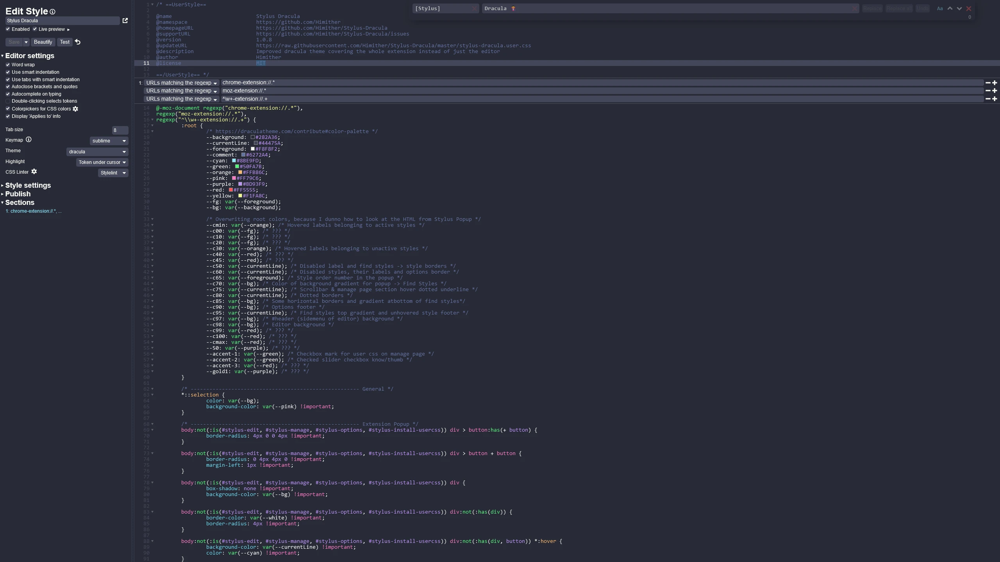
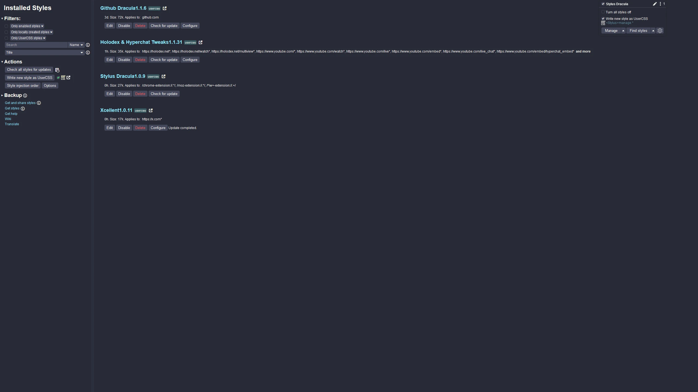

# Stylus-Dracula

## Description

Improved Dracula theme covering the whole extension instead of just the editor

## Note

> [!WARNING]
> You need to activate the extensions own Dracula theme to ensure the editor itself is themed properly, too.

## Preview

  
&nbsp; &nbsp; &nbsp; &nbsp;
  

  
&nbsp; &nbsp; &nbsp; &nbsp;
  

